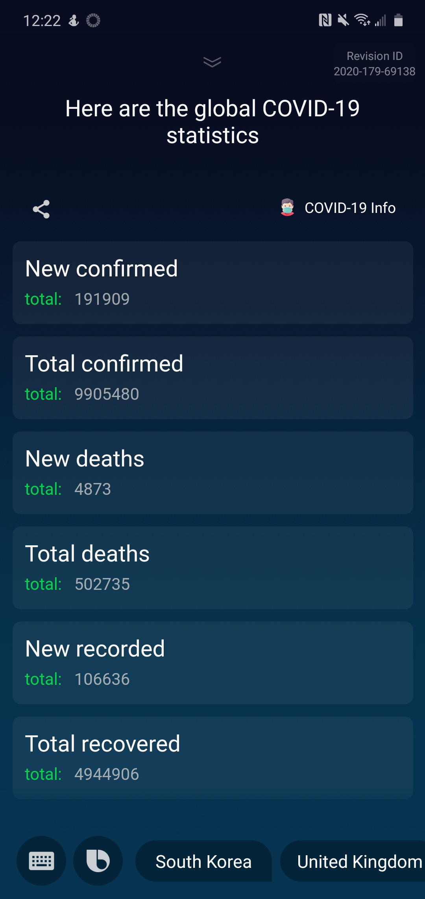

# Coronavirus Bixby Capsule
 ## Revision ID : 2020-179-69138
 - Bixby capsule to return coronavirus statistics globally and by country.
 - API endpoint : `https://documenter.getpostman.com/view/10808728/SzS8rjbc?version=latest#intro`

# Requirements
 - Bixby enabled device.
 - Developer option in Bixby settings, enable on-device testing. 

# Steps
 1. Once on-device testing is enabled through Bixby settings.
 2. Insert revision ID : `2020-179-69138` to testing.

# NL utterance
 ## Version 1.0.0
    - Show me the global virus statistics.
 ## Capsule screenshot
 

# Current workings
 - In the process of integrating queries by country.
