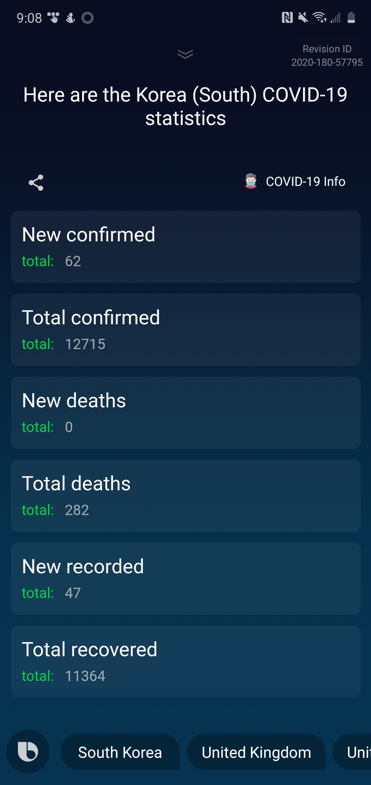

# Coronavirus Bixby Capsule
 ## Revision ID : 2020-180-57795
 - Bixby capsule to return coronavirus statistics globally and by country.
 - API endpoint : `https://documenter.getpostman.com/view/10808728/SzS8rjbc?version=latest#intro`

# Requirements
 - Bixby enabled device.
 - Developer option in Bixby settings, enable on-device testing. 

# Set up
 1. Once on-device testing is enabled through Bixby settings.
   - Go to Bixby voice setting
   - About Bixby voice
   - Tap on version number until `developer option enabled` notice appears
 2. Developer options
   - On-device tesing
   - Insert revision ID to testing.

# NL utterance
 ## Version 1.0.5
  ### Global
      - Show me the global virus statistics
  ### By country
    - Show me the South Korea statistics
    - Show me the United Kingdom statistics
    - Show me the United States statistics
    - Show me the US statistics
 ## Capsule screenshot - Global query response
 
 
 ## Capsule screenshot - By country query response
 

# Current workings
 - Add error handlers
 - Add queries for conversational drivers
 - Add flexible NL for global statistics
